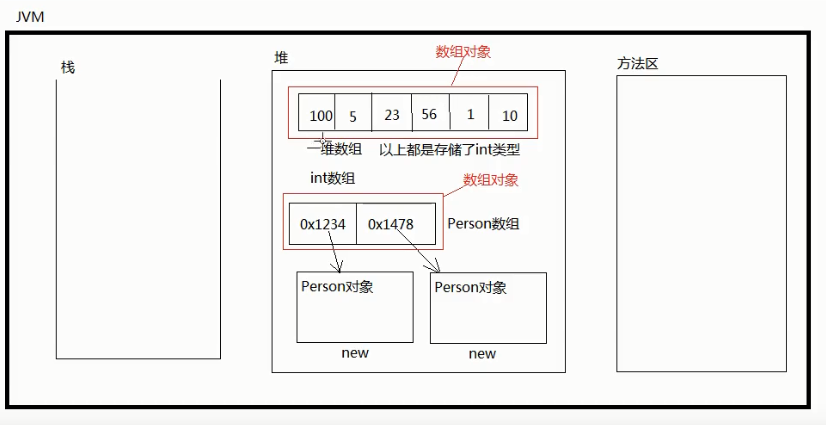

---

---

```
 https://www.bilibili.com/video/BV1P7411V7nQ?p=226
```

### jvm

#### 内存图首入


#### 递归内存图


#### 对象内存图


#### 对象作为实例变量的内存图


**执行javac Test.java生成Test.class，User.class和Address.class，在运行 java Test的时候jvm就有如下内存图**   


#### 值拷贝

**Java中都是值拷贝，不是引用，基本类型是把保存在内存中的值拷贝，引用类型也是把保存在内存中的地址值拷贝**


#### 253静态变量jvm


#### 254 空指针异常

```
p1 = null;
重点 空指针异常只有在 空引用访问实例相关
p1.country 访问静态变量也行，其实将p1变成Person.country进行访问了，所以可以空指针访问
```

#### 262 this 内存结构


#### 311 super内存结构

```java
Public Class SuperTest{
    public static void mian(String[] args){
        CreditAccount ca1 = new CreditAccount();
        CreditAccount ca2 = new CreditAccount("11111", 10000, 0.999);
    }
} 

class Account extends Object{
    private String actno;
    private double balance;
    public Account(){}
    public Account(String actno, double balance){
        this.actno = actno;
        this.balance = balance;
    }
}
class CreditAccount extends Account{
    private double credit;
    public CreditAccount(){}
    public CreditAccount(String actno, double balance, double credit){
        super(actno, balance);
        this.credit = credit;     
    }
}

```


####  super&this调用实例变量


#### super. 什么时候不能省略

* 子父类都有重名变量，子类想访问 父类的特征，super.不能省略

 


#### 数组内存图



### 类

#### 方法覆盖

##### 方法覆盖条件


##### 静态方法不存在方法覆盖

```
下图的a.doSome() 还是输出的Animal的doSome()；当然Animal.doSome输出Animal的，Cat的doSome输出Cat的
```


##### 覆盖的返回值类型可不同？

* 如果是基本数据类型返回值，返回值类型必须相同。引用类型，子类的返回值可以变小，但不能变大。实际开发中，返回值类型都写一样的，变小没意义


#### 多态

##### 多态运行机制

```
cat,bird extends animal, dog not extends animal
```


##### 向下转型风险


##### 封装，继承，多态关系

* 有了封装这种整体概念之后，对象雨对象才生继承，有了继承之后，才有了方法覆盖，继而有多态。方法覆盖要和多态在一起才有意义。

#### super

##### super和this对比


##### super不是引用


#### final

1、final 修饰的类无法被继承

2、final 修饰的方法无法被覆盖

3、final修饰的局部变量只能赋一次值

4、final修饰的引用只能指向一个对象，该对象无法被垃圾回收器回收，直到当前方法结束，才会释放空间。但是该对象的内部数据可以修改

```
public static void main(String[] args){
    final int m;
    m = 20;  // right
    m = 30; // error
    
    final Person p = new Person();
    p = new Person() ; // error p = null 也是错的
}
```
5、final 修饰的实例变量必须手动赋值，不能使用使用默认值

* 因为new 对象的时候，构造器会默认初始化实例变量(如this.name = null)，但是因为final修饰的变量只能赋值一次，那这样以后name就无法被赋值了，但是可以写成如下，只要是构造器就显示指定this.name = value;

  ```
  class Person{
      final String name;
      public Person(){
          this.name = "ccc";
      }
      public Person(String name){
          this.name = name;
      }
  }
  ```


6、final修饰的实例变量一般和static联合使用，成为常量，用大写  public static final double PI = 3.14

#### 抽象类

##### 图示抽象类的由来


##### 抽象类的性质

1、[修饰符列表] abstract class 类名{ 类体; }

2、抽象类是无法实例化，无法创建对象，所以抽象类是被子类继承的

3、final和abstract不能联合使用，因为final修饰的类无法被继承，而abstract修饰的类需要被继承(当然你写一个抽象类可以不去继承他，写了不继承就可不用写了)

4、抽象类的子类可以是抽象类，也可以是非抽象类

5、**抽象类虽然无法实例化，但是抽象类有构造方法，这个构造方法是供子类使用的**

6、抽象类中可以有抽象方法（没有方法体，以封号结尾）public abstract void doSome();

7、抽象类中不一定有抽象方法，但抽象方法必须出现在抽象类中

8、一个非抽象的类继承抽象类，必须将抽象类中的方法重写

#### 接口

##### 接口基础语法

1、接口是一种引用数据类型

2、接口是完全抽象的

3、接口定义：[修饰符列表] interface 接口名{}

4、接口支持多继承

5、接口只有常量 + 抽象方法

6、接口中所有的元素都是public修饰的

7、接口中抽象方法的public abstract可以省略

8、接口中常量的public static final可以省略

9、接口中的方法不能有方法体

10、一个非抽象的类，实现接口的时候，必须将接口中所有的方法都实现、

11、一个类可以实现多个接口

12、extends和implements可以共存，extends在前，implements在后

13、使用接口写代码的时候，可使用多态（父类型引用指向子类型对象）

（ps ：接口一般都是对行为的抽象，**接口中没有构造方法**）


##### 类实现接口

1、类和类之间叫继承(extends)，类和接口之间叫实现(implements)，实现可以认为是继承

2、当一个非抽象的类实现接口，必须将接口中的方法全部实现（方法覆盖）**因为非抽象类中不能有抽象方法**

3、接口之间强制类型转型可以没有继承关系，但是可能会出现ClassCaseException异常

```java
public class Test{
	public static void main(String[] args) {
		A a1 = new D();
		// A,B,C三个类型都没有关系，因为D实现了A,B，所以将a1强转B，编译运行都没问题，还能调用b的方法
		B b1 = (B) a1;
		b1.b();
		// 转成C类型，编译通过，但是运行报错
	    //C c1 = (C)a1;
		// 所以需要用instanceof来判断
		System.out.println(a1 instanceof B); // true
		System.out.println(a1 instanceof C); // false
	}
}

interface A{void a();}

interface B{void b();}

interface C{}

class D implements A,B {
	public void a(){
		System.out.println("a");
	}
	public void b(){
		System.out.println("b");
	}
}
```

##### 接口在开发中的应用

多态：面向抽象编程，不是面向具体编程，降低耦合度，提升扩展力。即OCP原则（对扩展开放，对修改关闭）

```java
public void feed(Animal a) // 父类 比 子类 更抽象，所以我们称为面向抽象编程
```

总结：接口离不开多态，接口 + 多态 可降低耦合度

- 任何一个接口都有调用者和实现者；
- 接口可以将调用者和实现者解耦合
- 调用者面向接口调用
- 实现者面向接口编写实现

##### 类型与类型之间的关系

- is a: ”继承关系“ Cat is a Animal 

- has a: “关联关系” ，通常以“属性”的形式存在 

  ```java
  A{
      B b;
  } 
  ```

- like a: “实现关系”，厨师像一个菜单

#### Object

##### equals

- “==” 用于判断两个变量保存的值，可用于判断基本数据类型，如果判断引用类型，只能确定是否为同一个对象
- 判断两个引用类型的，需要重写equals方法

```java
public class MyTime{
  private int year;
  private int month;
  public boolean equals(Object obj){
      if (obj == null || !(obj instanceof MyTime)) {
          return false;
      }
      if (this == obj) {
          return true;
      }
    MyTime t = (MyTime) obj;
    return this.year == t.year && this.month == t.month;
	}  
}

```

##### toString

- Object的toString方法是对象内存地址的16进制 + 类名

##### finalize

- 如果想在对象在垃圾回收机制回收的时候记录下时间，可以重写，无需手动调用，垃圾回收机制会自动调用

  ```
  protected void finalize() throws TRhrowable{
      System.out.println("即将被销毁" + 时间);
  }
  ```

#### 匿名内部类

`1` 内部类的分类

- 静态内部类：类似于静态变量
- 实例内部类：类似于实例变量
- 局部内部类：相当于局部变量
- 

`2`  进阶

```
class Test{
    static class Inner1{}
    class Inner2{}
    public void doSome(){
        class Inner3{}
    }
    public void doOther(){
        // doSome 方法中的局部内部类Inner3无法调用
        new Inner1();
        new Inner3();
    }
}
```


```java
// 不建议使用匿名内部类
public class Test{
	public static void main(String[] args) {
		MyMath m = new MyMath();
		m.mySum(new Compute(){
			public int sum(int a, int b){
				return a + b;
			} // 这里匿名内部类需要实现接口的方法
		}, 10, 20 );
	}

}

interface Compute{
	int sum(int a, int b);
}

class MyMath{
	public void mySum(Compute c, int x, int y){
		int sumValue = c.sum(x, y);
		System.out.println("x + y = " + sumValue);
	}
}
```


