---

---

```
 https://www.bilibili.com/video/BV1P7411V7nQ?p=226
```

### jvm

基本数据类型在内存图中保存的是值，应用数据类型保存的是内存地址

#### 内存图首入


#### 递归内存图


#### 对象内存图


#### 对象作为实例变量的内存图


**执行javac Test.java生成Test.class，User.class和Address.class，在运行 java Test的时候jvm就有如下内存图**   


#### 值拷贝

**Java中都是值拷贝，不是引用，基本类型是把保存在内存中的值拷贝，引用类型也是把保存在内存中的地址值拷贝**


#### 253静态变量jvm


#### 254 空指针异常

```
p1 = null;
重点 空指针异常只有在 空引用访问实例相关
p1.country 访问静态变量也行，其实将p1变成Person.country进行访问了，所以可以空指针访问
```

#### 262 this 内存结构


#### 311 super内存结构

```java
Public Class SuperTest{
    public static void mian(String[] args){
        CreditAccount ca1 = new CreditAccount();
        CreditAccount ca2 = new CreditAccount("11111", 10000, 0.999);
    }
} 

class Account extends Object{
    private String actno;
    private double balance;
    public Account(){}
    public Account(String actno, double balance){
        this.actno = actno;
        this.balance = balance;
    }
}
class CreditAccount extends Account{
    private double credit;
    public CreditAccount(){}
    public CreditAccount(String actno, double balance, double credit){
        super(actno, balance);
        this.credit = credit;     
    }
}

```


####  super&this调用实例变量

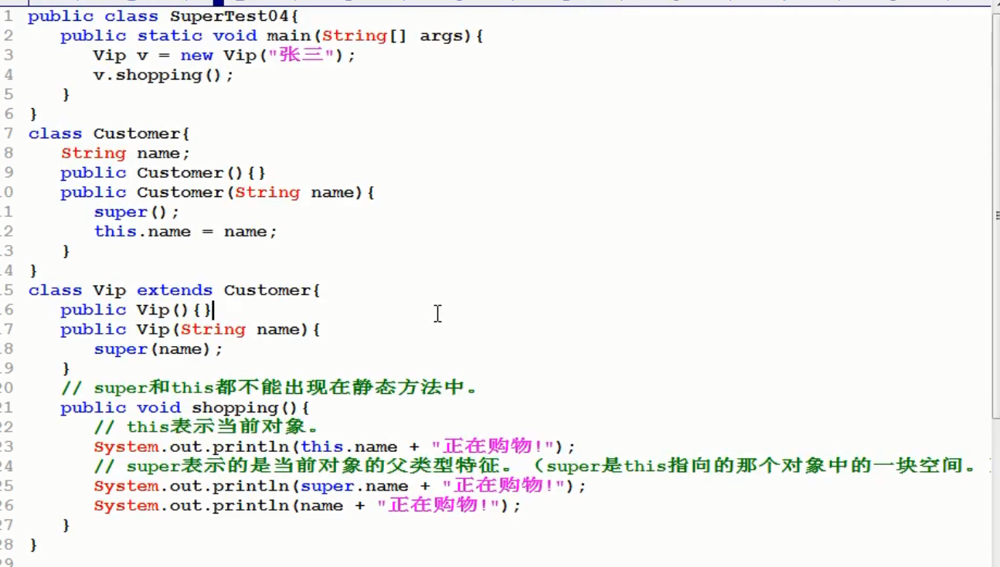

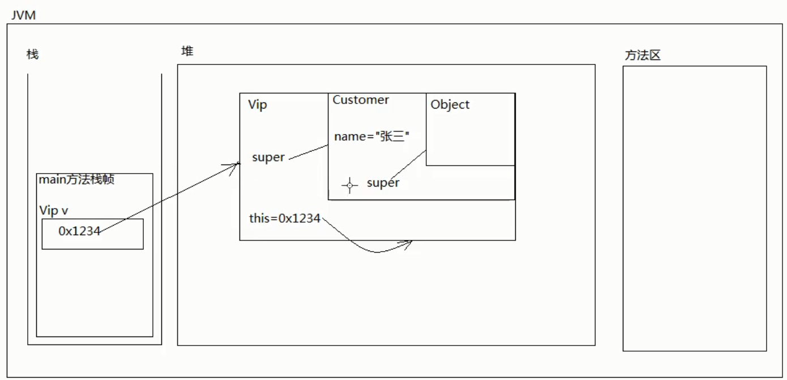

#### super. 什么时候不能省略

* 子父类都有重名变量，子类想访问 父类的特征，super.不能省略

 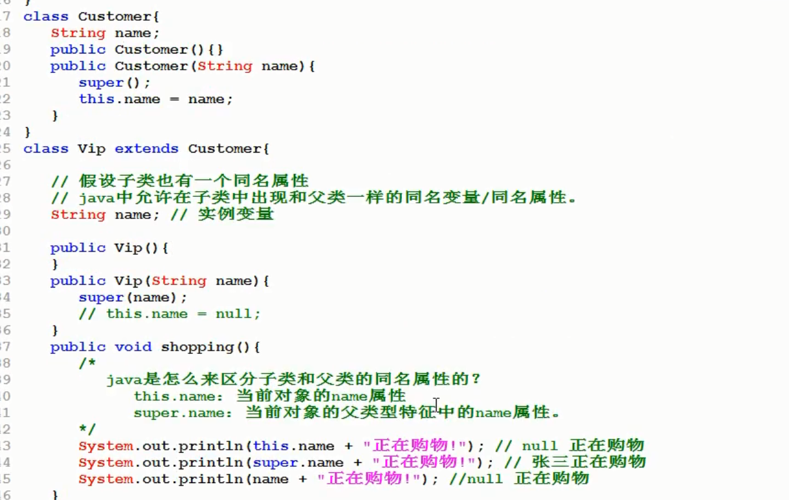

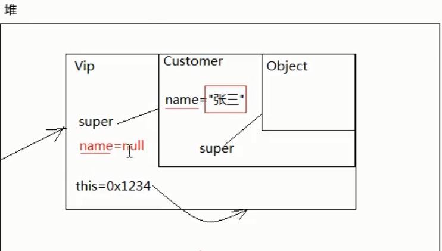


#### 数组内存图

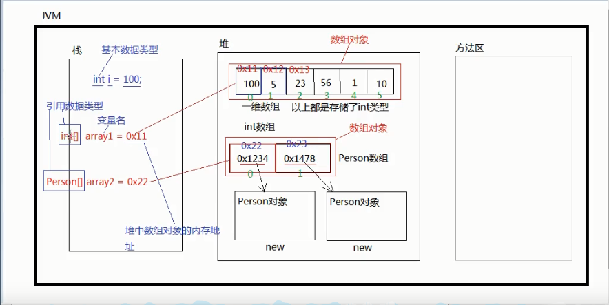

#### String 内存图

##### 内存图

- 字符串都是在方法区的字符串常量池中，垃圾回收器不会释放常量

```java
public static void main(String[] args) {
    // 下面2行代码创建了3个字符串对象，都在常量池中
    String s1 = "abcdef";
    String s2 = "abcdef" + "xy";

    // new对象一定在堆内存中开辟空间，堆中存放字符串在常量中的内存地址
    String s3 = new String("xy");
}
```

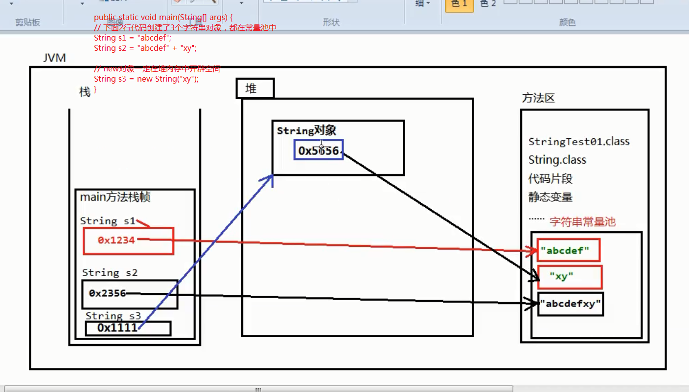

##### 字符串实例变量内存图

```java
public class Test{
	public static void main(String[] args) {
		User  user = new User(100, "张三");
	}
}

class User{
	private int id;
	private String name;

	public User(int id, String name){
		this.id = id;
		this.name = name;
	}
}
```

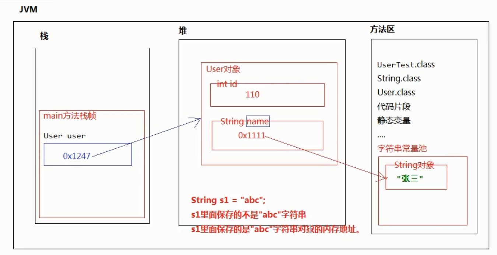

##### “==” 比较双引号字符串

```java
String s1 = "hello";
String s2 = "hello";
s1 == s2 // true

String x = new String("xyz");
String y = new String("xyz");
x == y; // false
```

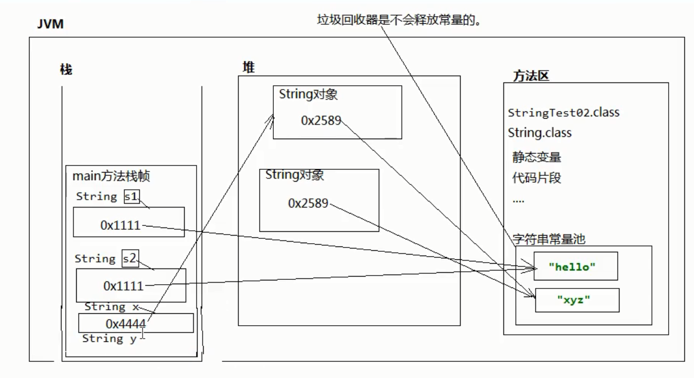

#### contains内存图

```java
Collection c = new ArrayList();
String s1 = new String("abc");
c.add(s1);
String s2 = new String("def");
c.add(s2);
String x = new String("abc");
c.contains(x); // true 因为底层调用了Object的equals方法，因为多态，从而调用了String的equal方法，而String的equals方法重写了，所以为true。
// 所以如果放入的是不是字符串对象，需要重写equals方法(String, Integer不用重写，因为已经重写了)，否则比较的是内存地址，如下
class User{
    private String name;
    public boolean equals(Object o){}
    
}
```

```java
Collection c = new ArrayList();
String s1 = new String("abc");
c.add(s1);
String s2 = new String("abc");
c.add(s2);
c.remove("abc");
s.size; // 0 因为调用了equals方法，如果equals为ture则删除
```


'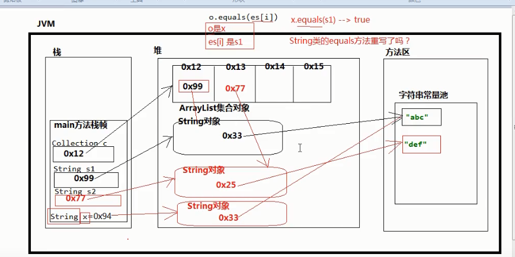


### 类

#### 方法覆盖

##### 方法覆盖条件


##### 静态方法不存在方法覆盖

```
下图的a.doSome() 还是输出的Animal的doSome()；当然Animal.doSome输出Animal的，Cat的doSome输出Cat的
```


##### 覆盖的返回值类型可不同？

* 如果是基本数据类型返回值，返回值类型必须相同。引用类型，子类的返回值可以变小，但不能变大。实际开发中，返回值类型都写一样的，变小没意义


#### 多态

##### 多态运行机制

```
cat,bird extends animal, dog not extends animal
```


##### 向下转型风险

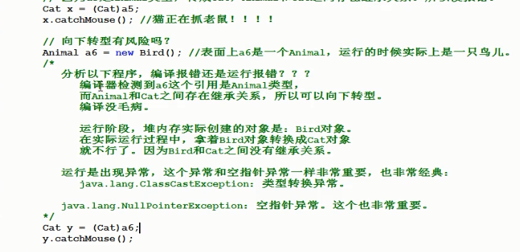

##### 封装，继承，多态关系

* 有了封装这种整体概念之后，对象雨对象才生继承，有了继承之后，才有了方法覆盖，继而有多态。方法覆盖要和多态在一起才有意义。

#### super&this

##### super和this对比


##### super不是引用


#### final

1、final 修饰的类无法被继承

2、final 修饰的方法无法被覆盖

3、final修饰的局部变量只能赋一次值

4、final修饰的引用只能指向一个对象，该对象无法被垃圾回收器回收，直到当前方法结束，才会释放空间。但是该对象的内部数据可以修改

```
public static void main(String[] args){
    final int m;
    m = 20;  // right
    m = 30; // error
    
    final Person p = new Person();
    p = new Person() ; // error p = null 也是错的
}
```
5、final 修饰的实例变量必须手动赋值，不能使用使用默认值

* 因为new 对象的时候，构造器会默认初始化实例变量(如this.name = null)，但是因为final修饰的变量只能赋值一次，那这样以后name就无法被赋值了，但是可以写成如下，只要是构造器就显示指定this.name = value;

  ```
  class Person{
      final String name;
      public Person(){
          this.name = "ccc";
      }
      public Person(String name){
          this.name = name;
      }
  }
  ```


6、final修饰的实例变量一般和static联合使用，成为常量，用大写  public static final double PI = 3.14

#### 抽象类

##### 图示抽象类的由来

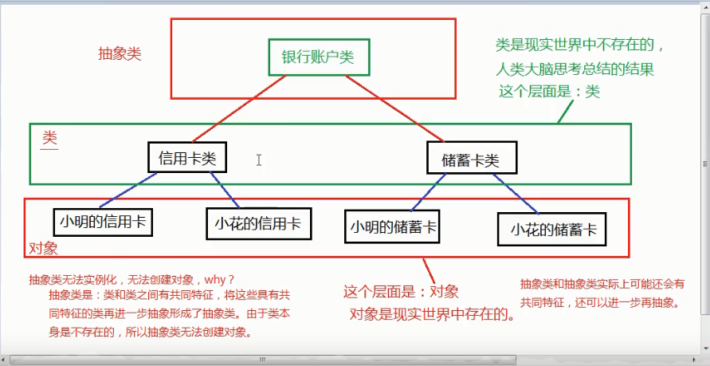

##### 抽象类的性质

1、[修饰符列表] abstract class 类名{ 类体; }

2、抽象类是无法实例化，无法创建对象，所以抽象类是被子类继承的

3、final和abstract不能联合使用，因为final修饰的类无法被继承，而abstract修饰的类需要被继承(当然你写一个抽象类可以不去继承他，写了不继承就可不用写了)

4、抽象类的子类可以是抽象类，也可以是非抽象类

5、**抽象类虽然无法实例化，但是抽象类有构造方法，这个构造方法是供子类使用的**

6、抽象类中可以有抽象方法（没有方法体，以封号结尾）public abstract void doSome();

7、抽象类中不一定有抽象方法，但抽象方法必须出现在抽象类中

8、一个非抽象的类继承抽象类，必须将抽象类中的方法重写

#### 接口

##### 接口基础语法

1、接口是一种引用数据类型

2、接口是完全抽象的

3、接口定义：[修饰符列表] interface 接口名{}

4、接口支持多继承

5、接口只有常量 + 抽象方法

6、接口中所有的元素都是public修饰的

7、接口中抽象方法的public abstract可以省略

8、接口中常量的public static final可以省略

9、接口中的方法不能有方法体

10、一个非抽象的类，实现接口的时候，必须将接口中所有的方法都实现、

11、一个类可以实现多个接口

12、extends和implements可以共存，extends在前，implements在后

13、使用接口写代码的时候，可使用多态（父类型引用指向子类型对象）

（ps ：接口一般都是对行为的抽象，**接口中没有构造方法**）


##### 类实现接口

1、类和类之间叫继承(extends)，类和接口之间叫实现(implements)，实现可以认为是继承

2、当一个非抽象的类实现接口，必须将接口中的方法全部实现（方法覆盖）**因为非抽象类中不能有抽象方法**

3、接口之间强制类型转型可以没有继承关系，但是可能会出现ClassCaseException异常

```java
public class Test{
	public static void main(String[] args) {
		A a1 = new D();
		// A,B,C三个类型都没有关系，因为D实现了A,B，所以将a1强转B，编译运行都没问题，还能调用b的方法
		B b1 = (B) a1;
		b1.b();
		// 转成C类型，编译通过，但是运行报错
	    //C c1 = (C)a1;
		// 所以需要用instanceof来判断
		System.out.println(a1 instanceof B); // true
		System.out.println(a1 instanceof C); // false
	}
}

interface A{void a();}

interface B{void b();}

interface C{}

class D implements A,B {
	public void a(){
		System.out.println("a");
	}
	public void b(){
		System.out.println("b");
	}
}
```

##### 接口在开发中的应用

多态：面向抽象编程，不是面向具体编程，降低耦合度，提升扩展力。即OCP原则（对扩展开放，对修改关闭）

```java
public void feed(Animal a) // 父类 比 子类 更抽象，所以我们称为面向抽象编程
```

总结：接口离不开多态，接口 + 多态 可降低耦合度

- 任何一个接口都有调用者和实现者；
- 接口可以将调用者和实现者解耦合
- 调用者面向接口调用
- 实现者面向接口编写实现

##### 类型与类型之间的关系

- is a: ”继承关系“ Cat is a Animal 

- has a: “关联关系” ，通常以“属性”的形式存在 

  ```java
  A{
      B b;
  } 
  ```

- like a: “实现关系”，厨师像一个菜单

#### Object

##### equals

- “==” 用于判断两个变量保存的值，可用于判断基本数据类型，如果判断引用类型，只能确定是否为同一个对象
- 判断两个引用类型的，需要重写equals方法

```java
public class MyTime{
  private int year;
  private int month;
  public boolean equals(Object obj){
      if (obj == null || !(obj instanceof MyTime)) {
          return false;
      }
      if (this == obj) {
          return true;
      }
    MyTime t = (MyTime) obj;
    return this.year == t.year && this.month == t.month;
	}  
}

```

##### toString

- Object的toString方法是对象内存地址的16进制 + 类名

##### finalize

- 如果想在对象在垃圾回收机制回收的时候记录下时间，可以重写，无需手动调用，垃圾回收机制会自动调用

  ```
  protected void finalize() throws TRhrowable{
      System.out.println("即将被销毁" + 时间);
  }
  ```

#### 匿名内部类

`1` 内部类的分类

- 静态内部类：类似于静态变量
- 实例内部类：类似于实例变量
- 局部内部类：相当于局部变量
- 

`2`  进阶

```
class Test{
    static class Inner1{}
    class Inner2{}
    public void doSome(){
        class Inner3{}
    }
    public void doOther(){
        // doSome 方法中的局部内部类Inner3无法调用
        new Inner1();
        new Inner3();
    }
}
```


```java
// 不建议使用匿名内部类
public class Test{
	public static void main(String[] args) {
		MyMath m = new MyMath();
		m.mySum(new Compute(){
			public int sum(int a, int b){
				return a + b;
			} // 这里匿名内部类需要实现接口的方法
		}, 10, 20 );
	}

}

interface Compute{
	int sum(int a, int b);
}

class MyMath{
	public void mySum(Compute c, int x, int y){
		int sumValue = c.sum(x, y);
		System.out.println("x + y = " + sumValue);
	}
}
```

### Other

#### 数组

##### 数组的优点

- 查询某个下标上的元素时效率极高，查询效率最高的数据结构

  - 每一个元素的内存地址在空间存储上实连续的
  - 每一个元素类型相同，所以占用空间大小一样
  - 知道第一个元素内存地址，知道每个元素占用空间大小，又知道下标，所以通过一个数学表达式可以计算出某个下标上元素的内存地址。直接通过内存地址定位元素，所以数组的检索效率实最高的

  数组中存储多少个元素检索效率都是一样的，他是根据计算内存地址来定位的。  

##### 数组的缺点

- 为了保证每个元素的内存地址连续，所以数组上删除或者增加元素，效率低，因为随机增删元素会涉及到后面元素统一向前或向后位移的操作
- 无法存储大数据量，因为很难在内存中找到连续的一块大内存

注意：对数组上最后一个元素的增删是没有影响的  

##### 数组的写法

```java
int[] arr0 = new int[3]; // 动态数组
arr[0] = 1;

int[] arr1 = {1,2,3}; // 静态数组

int[] arr2 = new int[]{1,2,3} // 如要作为形参传递函数内，静态数组必须用这种形式
printArray({1,2,3}) // error  | printArray(new int[]{1,2,3}) or printArray(arr1)  // right
```

##### String[] args

- jvm调用main方法，默认传的是一个空数组({} 或 new String[0])，在cmd中以空格分隔输入a b c，会被自动封装成{"a","b","c"}的数组传递进去，是命令行作用

##### 数组扩容

- 新建一个大容量的数组，然后将小容量数组中的数据一个一个拷贝到大数组中。效率较低，所以在创建数组的时候预估数组长度，减少扩容。

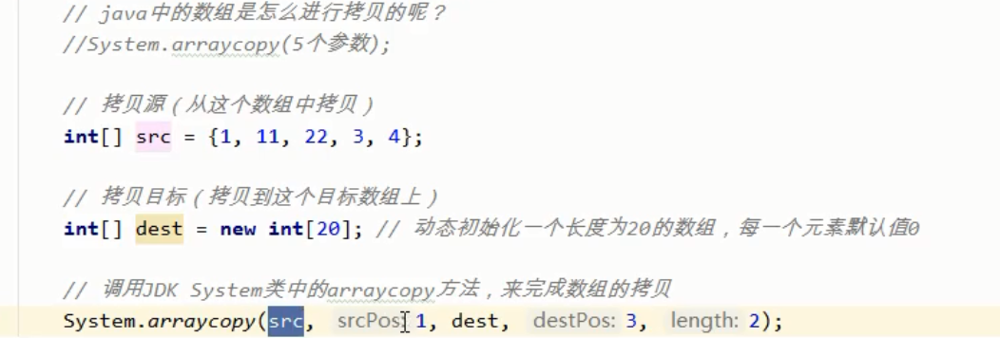

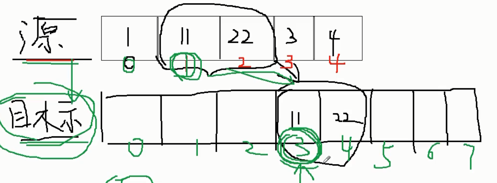

##### 二维数组

- 定义：里面的元素时一维数组

  ```java
  int[][] ar = {{1},{1,2,3},{2,3}}; // 静态初始化二维数组
  int[] ar0 = arr[0] // 取出二维数组的第一个元素
  
  int[][] arr = new int[2][3]; // 动态初始化
  arr[0] = new int[]{2,3,4} // 给第一个数组赋值 arr[0] = {1，2，3} error
  arr[0][0] = 2 // 给元素赋值
  
  printArray({{1},{1,2,3},{2,3}}) // 是错误的， 参考 一维数组一样
  ```

##### 排序&二分查找

- 冒泡排序：从小打大排序

  - 两两元素比较大小，大的值放在右边，遍历完一次的结果是最大值放到了数组末尾

  ```java
  // 用i--方式好写
  for(int i = arr.length-1; i > 0; i--){ // i是遍历的次数。如数组长度为7，i=arr.length-1=6：第一次遍历要交换的次数为6
      for(int j = 0; j < i; j++){ // j<i=6，第一次要遍历6次
          if(arr[j] > arr[j+1]){
              int tmp = arr[j];
              arr[j] = arr[j+1];
              arr[j+1] = tmp;
          }
  			}
  ```

- 选择排序：

  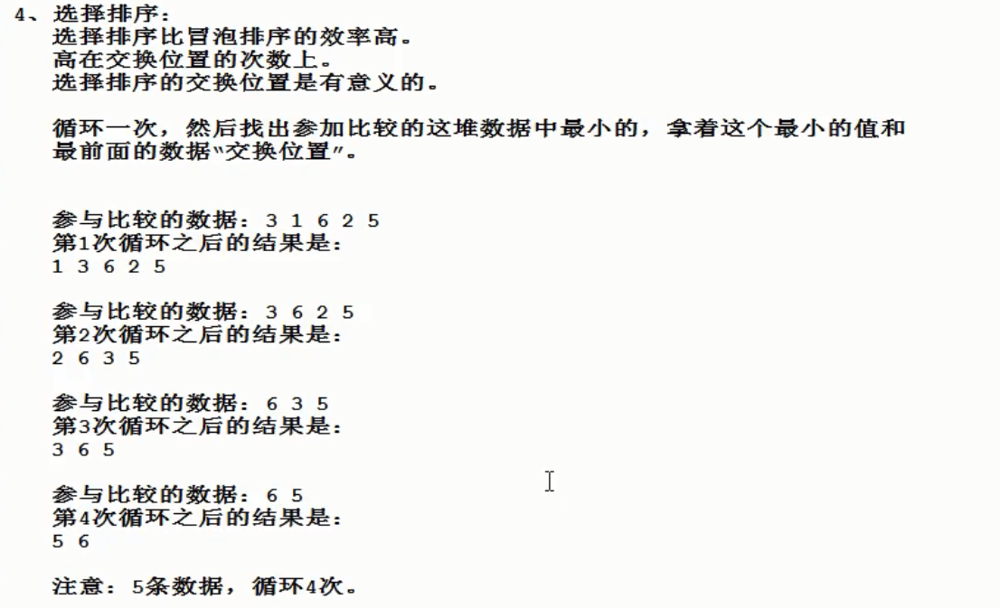

  

  ```javascript
  public static void sortArray(int[] arr){
      for(int i = 0;i < arr.length-1; i++){ // i是参与比较的这堆数据中的起点下标
          int min = i; // 假设起点i下标位置上的数组元素时最小的
  
          for(int j = i+1; j < arr.length; j++){
              if(arr[min] > arr[j]){
                  min = j;
              }
          }
          if(min != i){ // 当 i == min，表示猜测正确，当i != min，表示猜测错误，需要交换位置
              int temp;
              temp = arr[i];
              arr[i] = arr[min];
              arr[min] = temp;
          }
      }
  }
  ```

- 二分查找

  ```
  public int binarySearch(int[] arr, int dest){
      int begin = 0;
      int end = arr.length - 1;
      while(begin <= end){
          mid = (begin + end) / 2
          if(arr[mid] == dest){
              return mid;
          }else if(arr[mid] < dest){
              begin = mid + 1;
          }else{
              end = mid - 1;
          }
      } 
      return -1;
  }
  
  ```

  

#### Strings & Integer

##### 一共几个对象

```
String s1 = new String("hello");
String s2 = new String("hello");
// 一共3个对象，字符串常量池中1个： “hello”， 堆内存有2个String对象
```

##### 常用构造方法

```
byte[] bytes = {97, 98, 99};
String s2 = new String(bytes)l // print = abc

String s3 = new String(bytes, 1, 2) // print = bc

char[] chars = {'我','很','高', '很', '瘦'};
String s4 = new String(chars); // print = 我很高
String s4 = new String(chars， 1， 2); // print = 很高
```

##### stringBuffer

- StringBuffer底层是一个byte数组，往StringBuffer中放字符串，实际放到byte数组中了，StringBuffer的初始化容量为16

- 在创建StringBufferde时候，尽可能初始化容量，最好减少底层数组的扩容次数。

- 拼接字符换，调用append方法，如果用“+”方式，如下

  ```java
  String s = "abc";
  s += "hello";
  会在方法去常量池当中创建3个对象
  "abc" "hello" "abchello"
  ```

##### StringBuffer和StringBuilder的区别

- StringBuffer中的方法都有：synchronized关键字修饰。表示多线程环境运行安全
- StringBuilder中没有修饰，多线程运行不安全

##### StringBuffer和StringBuilder为什么可变

- 因为他们的内部是一个byte[]数组，并且没有被final修饰，初始化容量是16，存满之后会自动扩容，底层调用数据拷贝的方法，System.arraycopy()，所以适合字符串的频繁拼接操作

##### 自动装箱与拆箱

```java
// 自动装箱，x是一个引用，保存了对象的内存地址
Integer x = 100; // = new Integer(100);
// 自动拆箱
int y = x;
```

##### int-String-Integer转换

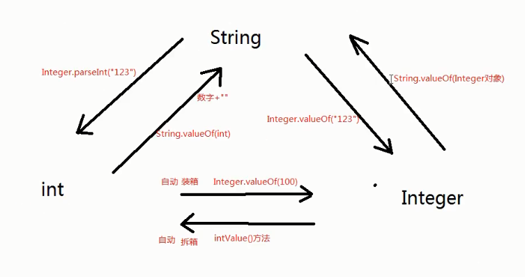

#### 日期&随机数&枚举

##### 日期格式化

```java
SimpleDateFormat sdf = new SimpleDateFormat("yyyy-MM-dd HH:mm:ss SSS");
String nowTimeStr = sdf.format(new Date()); // 当前时间

// 获取昨天的此时
Date time2 = new Date(System.currentTimeMillis() - 1000*60*60*24);
sft.format(time2);
```

##### 数字格式化

``` java
# 任意数字
,  千分位
. 小数点
0 不够时补0
###,###.## 表示： 加入千分位，保留2位小数
DecimalFormat df = new DecimalFormat("###,###.##");
String s = df.format(1234.561232); // 1,234.56 

DecimalFormat df = new DecimalFormat("###,###.0000");
String s = df.format(1234.56); // 1,234.5600
```

##### 高精度数字

```java
BigDecimal v1 = new BigDecimal(100); // 精度极高的100
BigDecimal v2 = new BigDecimal(200);
v1.add(v2) // 不能直接相加，因为是引用
v1.divide(v2);
```

##### 随机数

```
Random random = new Random();
random.nextInt(); // 随机产生一个int
random.nextInt(101); // 随机产生[0,100]的数
```

##### 枚举

```java
1. 枚举是引用数据类型
2. enum 枚举类型名{
    枚举1，枚举2
}
3. 只有2中情况，建议使用布尔类型，超过两种且可以一枚一枚列举出来的，使用枚举类型

```

#### 异常

##### 异常结构图

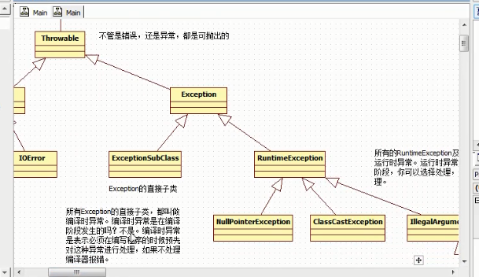


- IllegaArgumentException下有NumberFormatException （如Integer.Valueof() 可出现此一次）

```java
1. Object下有Throwable（可抛出的）
2. Throwable下有Error（不可处理，直接退出jvm）和Exception（可处理）
3. Exception下有2个分支：
  3.1 Exception的直接子类，编译时异常
  3.2 RuntimeException：运行时异常

```


- 编译时异常与运行时异常区别？
  - 编译时异常一般发生的概率高，又叫受检异常，受控异常
  - 运行时异常一般发生的概率低，又叫未受检异常，非受控异常

##### try--catch

```java
// 捕获多个异常，小的写在前面 ； 可以捕获父异常
try{
    FileInputStream fis = new FileInputStream("D:\\a.txt");
}catch(FileNotFoundException e){ // 小的Exception写在前面
    System.out.println("文件不存在");
}catch(IOException e){// 多态 IOException e = new FileNotFoundException();
    System.out.println("读文件报错");
}
```

#####  读取文件异常例子

```java
public static void main(String[] args){
    FileInputStream fis = null; // 如果写在try下是局部变量，finally中用不了
    try{
		fis = new FileInputStream("D:\\a.txt");
        String s = null;
        s.toString(); // 这里一定出现空指针异常
        System.out.println("hello");
        
    }catch(FileNotFoundException e){
        e.printStackTrace();
    }catch(IOException e){
        e.printStackTrace();
    }catch(NullPointException e){
        e.printStackTrace();
    }finally{
        // 流的关闭这里比较保险
        // finally中的代码一定会执行的，即使try出现了异常
        if(fis != null){
            try{
               fis.close();
            }catch(IOException e){
                e.printStackTrace();
            }
        }
    }
}
```

##### try-finally

```java
// 执行顺序： try - finally - return
try{
    System.out.println("try");
    return;  // 只有 System.exit();  try - exit 不执行finally了
}finally{
    System.out.println("finally");
}
```

- 面试题

  ```java
  int i = 100;
  try{
  // 这条代码出现在int i =100;的下面，所以最终结果必须是100，return语句还必须保证是最后执行的，一旦执行，则整个方法结束
      return i; // 100
  }finally{
      i++;
  }
  
  // 运行顺序：因为java中有两条规则，1. 方法体中的代码必须至上而下执行 2. return执行，则整个方法必须结束
  int i = 100;
  int j = i;
  i++;
  return j; 
  ```

  

##### 自定义异常

```java
public class MyException extends Exception{
	public MyException(){}
	public MyException(String s){
        super(s);
	}
}
```

##### 异常与方法覆盖

- 重写之后的异常不能比重写之前的异常抛出更多（更宽泛）的异常，可以更少


#### 集合

##### collection结构图

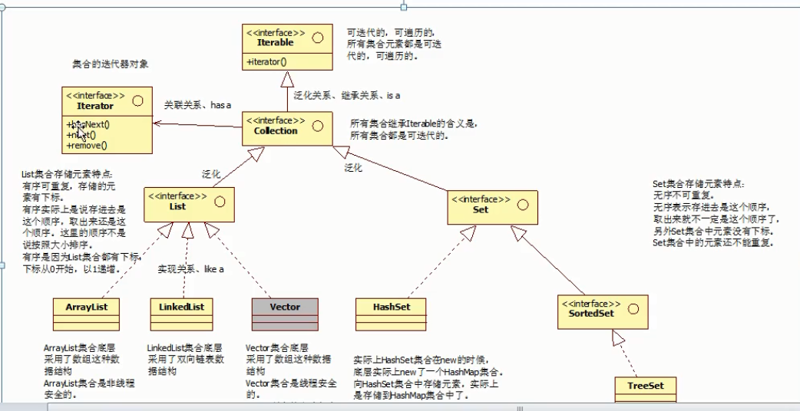

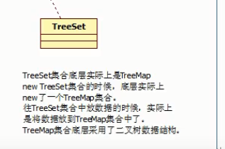

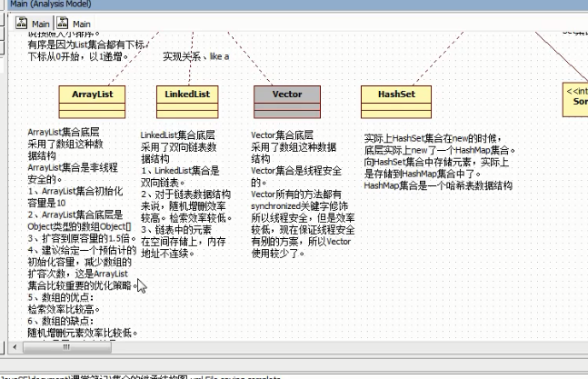


##### map结构图

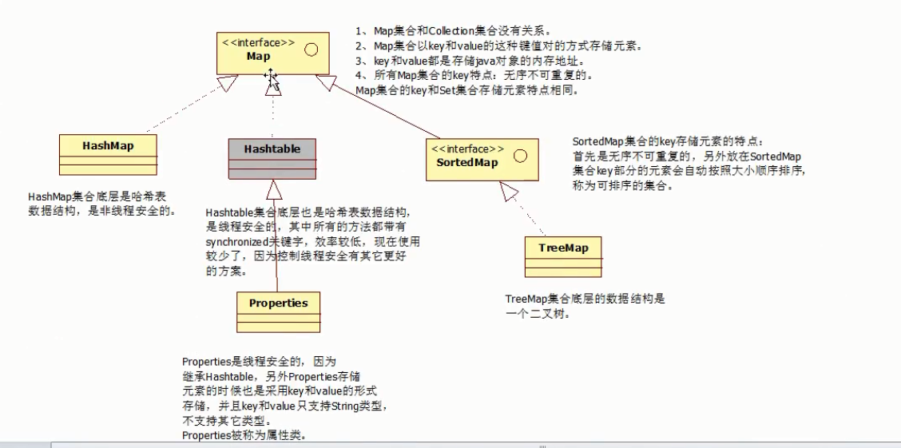

- 补充HashMap：在JDK8之后，如果哈希表单向链表中元素超过8个，单向链表这种数据结构会变成红黑树数据结构。当红黑树上的节点数量小于6时，会重新把红黑树编程单向链表数据结构，这种方式也是为了提高检索效率，二叉树的检索会再次缩小扫描范围，提高效率。初始化容量16，默认加载因子为0.75

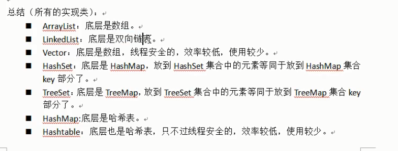

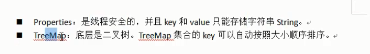

##### map常用方法

```java
void clear()
boolean containKey(Object key)
boolean containValue(Object value)
V get(Object key)
boolean isEmpty()
Set<Key> keySet()
V put(K key, V value)
V remove(Object key)
int size()
Collection<V> values()
Set<Map.Entry<K,V>> entrySet()
    将Map集合转换为Set集合
    示例：
    key           value
    1			zhangshan
    2			lisi
    3			wangwu
    4			zhaoliu
    
    Set set = map1.entrySet();
	set集合对象
	1=zhangsan
	2=lisi
	3=wangwu
	4=zhaoliu
	注意：Map集合通过entrySet()方法转换为Set集合，Set集合中元素的类型是Map.Entry<K,V>
	Map.Entry和String一样，是一种类型的名字，不过Map.Entry是Map静态内部类
```

##### 遍历集合的几种方式

```java
Map<Integer, String> map = new HashMap<Integer, String>();
map.put(1, "zhangsan");
map.put(2, "lisi");
map.put(3, "wangwu");
map.put(4, "zhaoliu");
Set<Integer> keys = map.keySet();

// 第一种方式
Iterator<Integer> it = keys.iterator();
while (it.hasNext()){
Integer key = it.next();
String value = map.get(key);
System.out.println(key + "=" + map.get(key));
}

// 第二种方式
for(Integer key:keys){
System.out.println(key + "=" + map.get(key));
}

// 第三种方式 entrySet
Set<Map.Entry<Integer,String>> set = map.entrySet();
Iterator<Map.Entry<Integer,String>> it2 = set.iterator();
while (it2.hasNext()){
Map.Entry<Integer,String> node = it2.next();
Integer key = node.getKey();
String value = node.getValue();
System.out.println(key + "=" + map.get(key));
}

// 第四种方式
for(Map.Entry<Integer,String > node:set){
System.out.println(node.getKey() + "----->" + node.getValue());
}
```


##### 迭代器删除元素

```java
Collection c = new ArrayList();
c.add("a");
c.add("b");
Iterator it = c.iterator();
while(it.hasNext()){
    Object o = it.next();
    // c.remove(o); // 删除当前元素后，集合的结构发生了变化，应该重新获取迭代器，会出现异常
    it.remove(); // 使用迭代器删除
    System.out.println(o);
}
```


##### ArrayList

- 扩容
  - 原容量的1.5倍
  - 尽可能少的扩容，因为数组扩容效率比较低，建议使用ArrayList集合的时候预估元素的个数，给定一个初始化容量
  - 数组优点：检索效率高
  - 数组缺点：随机增删元素效率低
  - ArrayList集合用的最多

##### 链表

- 单向链表

  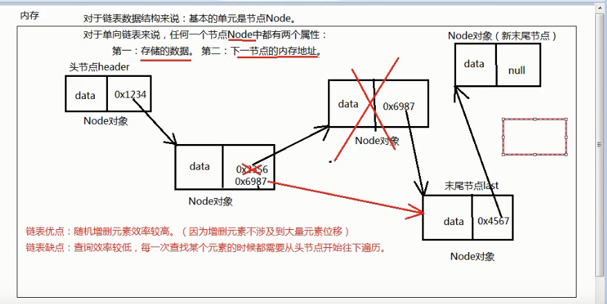

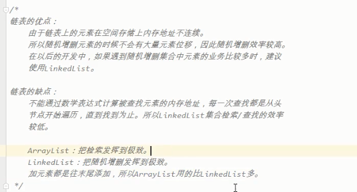

- 双向链表
  ```java
  // LinkedList没有初始化容量，最初链表没有任何元素，first和last的引用都为null；不管是LinkedList还是ArrayList，写代码不需要关心哪个集合，因为我们要面向接口编程，调用的方法都是接口中的方法
  List list = new LinkedList();
  lst.add("a");
  lst.add("b");
  // 源码：
  public boolean add(E e) {
  linkLast(e);
  return true;
  }
  void linkLast(E e) {
      final Node<E> l = last;
      final Node<E> newNode = new Node<>(l, e, null);
      last = newNode;
      if (l == null)
          first = newNode;
      else
          l.next = newNode;
      size++;
      modCount++;
  }
  private static class Node<E> {
      E item;
      Node<E> next;
      Node<E> prev;
  
      Node(Node<E> prev, E element, Node<E> next) {
          this.item = element;
          this.next = next;
          this.prev = prev;
      }
  }
  ```

  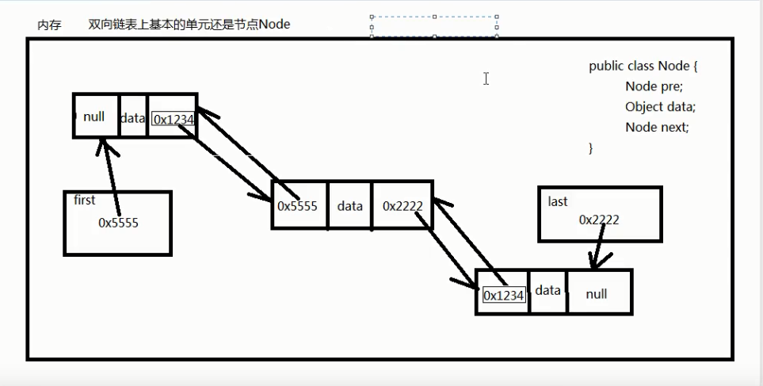


   第一次add


第二次add， new Node的时候l = 0x23


##### HashMap


- HashMap集合底层是哈希表/散列表的数据结构

  - 哈希表：数组和单向链表的结合体，充分发挥数组和链表的优势（一维数组，每一个元素是一个单向链表）

  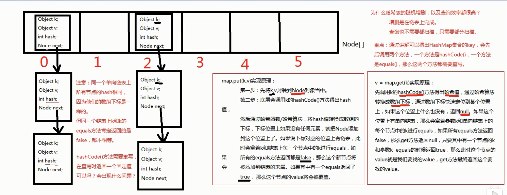


- 源码

  ```java
  public class HashMap{
      Node<k,v>[] table; // HashMap底层是一个一维数组
      static class Node<K,V> implements Map.Entry<K,V>{
          final int hash; // 哈希值（是key的hashCode()方法的执行结果。hash值通过哈希函数/算法，可以转换成数组的下标
          final K key; // 存储到Map集合中的key
          V value; // 存储到Map集合中的那个value
          Node<K,V> next; // 下一个节点的内存地址
      }
  }
  ```

- 需掌握map.put(k, v)，map.get(k) 原理

- key特点

  - 无序不可重复
  - 无序：不一定挂在哪个单向链表上
  - 不可重复：equals方法保证不可重复，如果key相同，则value覆盖
  - 放在HashMap中的key部分的元素其实放到HashSet集合中了，所以HashSet集合中的元素也需要同时重写hashCode()和equal()方法

- HashMap使用不当无法发挥性能

  - **hashCode()方法返回固定值** ：导致底层哈希表变成了纯单向链表，这称为散列分布不均匀
  - **hashCode()方法返回值都不一样**：底层变成了一维数组了，也是散列分布不均匀
  - 散列分布均匀：100个元素，10个单向链表，每个单向链表上10个节点，这是最好的
  - 散列分布均匀需要你重写hashCode()方法的时候有一定的技巧
  - HashMap集合的默认初始化容量是16，默认加载因子是0.75
    - **默认加载因子**：当HashMap集合底层数组的容量达到75%，数组开始扩容
    - 初始化容量必须是**2**的倍数，这是因为达到散列均匀，为了提高HashMap集合的存取效率所必须的

- 注意：**equals方法和hashCode方法必须同时重写**。如果equals方法返回true，那么hashcode方法必须返回true，而如果hashcode()方法不重写，调用Object的hashCode方法，可能返回的是哈希值就不一样（如下代码）。equals方法返回true，表示两个对象相同，在同一个单向链表上比较。那么对于同一个单向链表上的节点来说，他们的哈希值都是相同的，所以hashCode()方法的返回值也应该相同

```
// 只重写euqals方法
Student s1 = new Student("zhangsan");
Student s2 = new Student("zhangsan");
s1.equals(s2); // true
s1.hashCode();// Student的内存地址 2010102
s2.hashCode();// Student的内存地址 2010101

```


#### 泛型

##### 定义

```
List<Animal> myList = new ArrayList<Animal>(); // 使用泛型，list中只允许存储Animal类型的数据
myList.add("abc"); // 存储其他类型就编译报错
Cat c = new Cat();
Bird b = new Bird();
myList.add(c);
myList.add(b);
Iterator<Animal> it = myList.iterator();
while(it.hasNext()){
    Animal a = it.next(); // 使用泛型，每一次迭代返回的数据都是Animal类型
    a.move(); //  这里不需要使用强制类型转换，直接使用
}
```

##### 自定义类型

```java
MyIterator<String> m1 = new MyIterator<String>();
String s1 = m1.get();

MyIterator<Integer> m2 = new MyIterator();
Integer i1 = m2.get();
class MyIterator<T>{
    public T get(){
        return null;
    }
}
```

#### 线程

##### 线程生命周期五大状态

- 锁池不属于状态

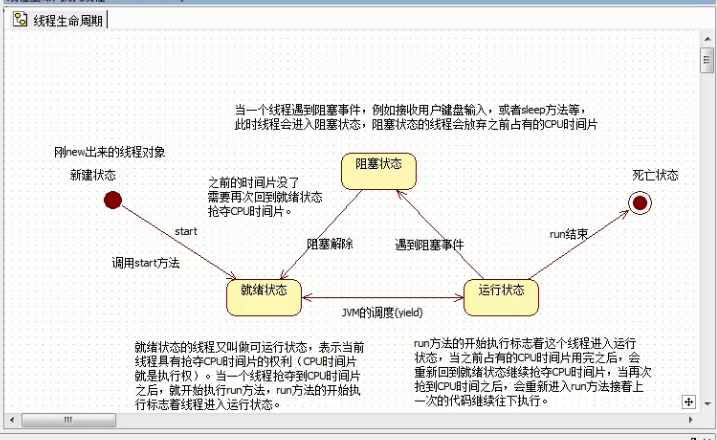

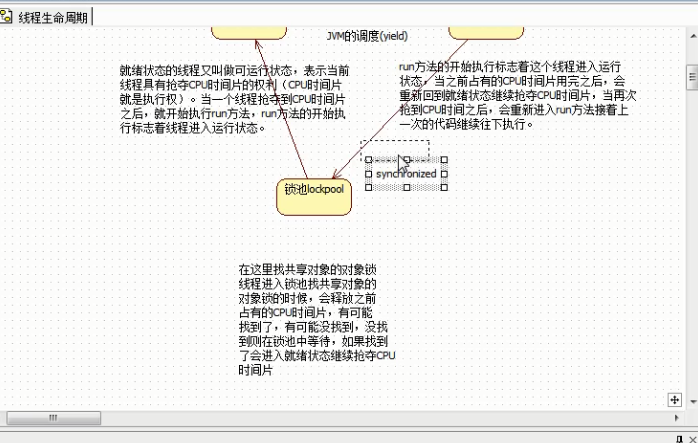

##### sleep面试题

```java
public class Hello {
    public static void main(String[] args) {

        Thread t = new MyThread();
        t.setName("t");
        t.start();
        try {
            t.sleep(1000 * 5); // 执行的时候还是会转成Thread.sleep(1000*5)，这行代码的作用是让当前线程进入休眠，让main线程休眠，不是让线程t进入休眠，所以over是最后输出的。
        } catch (InterruptedException e) {
            e.printStackTrace();
        }
        System.out.println("over");
    }
}

class MyThread extends Thread{
    public void run(){
        for(int i=0;i<100;i++){
            System.out.println(i);
        }
    }
}
```

##### interrupt终止睡眠

```java
public static void main(String[] args) throws InterruptedException {
    Thread t = new Thread(new MyRunnable());
    t.start();
    t.sleep(1000); // 希望1s之后t线程醒来（主线程的活干完了）
    t.interrupt(); // 终止t线程的睡眠，依靠java的异常处理机制，所以本次会输出异常信息，再打印“end”
}
class MyRunnable implements Runnable{

    @Override
    public void run() {
        try {
            Thread.sleep(1000 * 60 * 60);
        } catch (InterruptedException e) {
            e.printStackTrace();
        }
        System.out.println("end");
    }
}
```

##### stop强行终止线程的执行

```java
public static void main(String[] args) throws InterruptedException {
    Thread t = new Thread(new MyRunnable());
    t.start();
    t.sleep(1500);
    // t.stop(); // 输出 0 1 2  // 已被弃用，数据不安全
    t.interrupt(); // 输出 0 1 2 ... 9
}
class MyRunnable implements Runnable{
    @Override
    public void run() {
        for (int i = 0; i < 10; i++) {
            System.out.println(i);
            try {
                Thread.sleep(500);
            } catch (InterruptedException e) {
                e.printStackTrace();
            }
        }
    }
}
```

##### 合理终止线程

````java

public class Hello {
    public static void main(String[] args) throws InterruptedException {
        MyRunnable r = new MyRunnable();
        Thread t = new Thread(r);
        t.start();
        t.sleep(1500);
        r.run = false;
    }
}

class MyRunnable implements Runnable{
    boolean run = true;
    @Override
    public void run() {
        for (int i = 0; i < 10; i++) {
            if(run){
                System.out.println(i);
                try {
                    Thread.sleep(500);
                } catch (InterruptedException e) {
                    e.printStackTrace();
                }
            }else{
                return;
            }

        }
    }
}
````

##### 线程调度方法

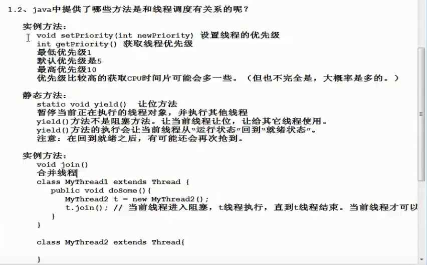

##### 线程让位

```java
public class Hello {
    public static void main(String[] args) throws InterruptedException {
        Thread t = new Thread(new MyRunnable());
        t.start();

        for (int i = 0; i < 10000; i++) {
            System.out.println("main " + i);
        }
    }
}

class MyRunnable implements Runnable{
    @Override
    public void run() {
        for (int i = 0; i < 10000; i++) {
            if(i % 100 == 0){
                Thread.yield(); // 执行100次就让给其余线程执行
            }
            System.out.println("分支 " + i);
        }
    }
}
```


##### 线程合并

```java
public class Hello {
    public static void main(String[] args) throws InterruptedException {
        Thread t = new Thread(new MyRunnable());
        t.start();
        t.join(); // t合并到当前线程中，当前线程阻塞，t线程执行直到结束
        System.out.println("over"); // over最后输出
    }
}

class MyRunnable implements Runnable{
    @Override
    public void run() {
        for (int i = 0; i < 10000; i++) {
            System.out.println(i);
        }
    }
}
```

 ##### 线程安全

- 什么时候数据在多线程并发的环境下存在安全问题？
  - 多线程并发
  - 有共享数据
  - 共享数据有修改的行为（只是查询都不涉及线程安全）
- 如何解决？
  - 使用“线程同步机制”， 即不能并发
- 线程同步涉及两个专业术语
  - 异步编程模型：并发
  - 同步编程模型：排队
- 变量的线程安全
  - 局部变量永远不会存在线程安全问题，因为不是共享数据；
  - 常量也没有线程安全问题，因为不可修改；
  - 堆和方法区都是多线程共享的，所以静态变量和实例变量存在线程安全；

##### synchronized

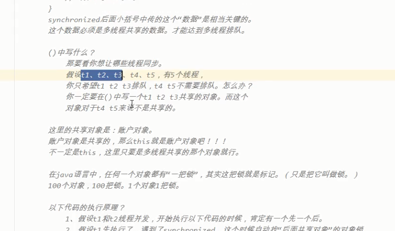

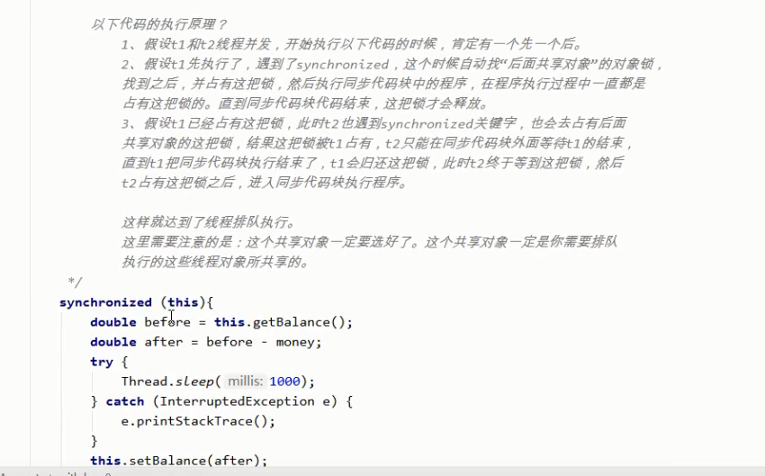

 

```java
class Account {

    private String account;
    private int balance;

    Object obj = new Object(); 

    public Account(){}

    public Account(String account, int balance) {
        this.account = account;
        this.balance = balance;
    }

    public String getAccount() {
        return account;
    }

    public void setAccount(String account) {
        this.account = account;
    }

    public int getBalance() {
        return balance;
    }

    public void setBalance(int balance) {
        this.balance = balance;
    }
	
//    public synchronized void withDraw(int money)  { // 出现在实例方法上，表示整个方法都需要同步，可能会扩大同步范围，效率较低；共享的对象只能是this，不灵活；好处是：代码写少了
    public void withDraw(int money)  {
//        synchronized (this){ // 效果与obj一样，括号里只要共享对象就行
        
       // synchronized ("abc"){ // 所有线程都会同步
//        Object obj2 = new Object(); // 这个不行，因为不是共享对象
        synchronized (obj){
            int before = this.getBalance();
            int after = before - money;
            try {
                Thread.sleep(1000);
            } catch (InterruptedException e) {
                e.printStackTrace();
            }
            this.setBalance(after);
        }
    }
}

class AccountThread implements Runnable{

    private Account account;

    public AccountThread(Account account){
        this.account = account;
    }

    @Override
    public void run() {
        account.withDraw(5000);
        System.out.println("账户：" + account.getAccount() + " 余额 " + account.getBalance());
    }
}

public class Test {
    public static void main(String[] args) {
        Account account = new Account("ac1", 10000);
        Thread t1 = new Thread(new AccountThread(account));
        Thread t2 = new Thread(new AccountThread(account));
        t1.start();
        t2.start();
    }
}
```


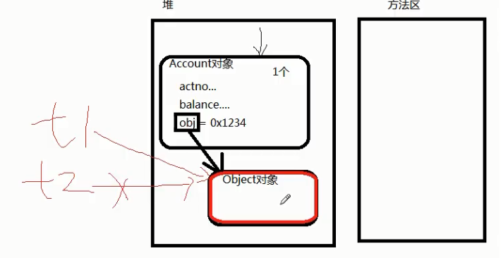


###### 面试题

- 静态方法是类锁，不管创建几个对象，类锁都只有一个，所以结果是t2需要等待t1执行完成

```java
public class Test {
    public static void main(String[] args) throws InterruptedException {
        MyClass m1 = new MyClass();
        MyClass m2 = new MyClass();

        Thread t1 = new MyThread(m1);
        Thread t2 = new MyThread(m2);
        t1.setName("t1");
        t2.setName("t2");

        t1.start();
        Thread.sleep(1000); // 作用是保证t1先执行
        t2.start();
    }

}

class MyThread extends Thread{
    MyClass m;
    public MyThread(MyClass m){
        this.m = m;
    }

    public void run(){
        if(Thread.currentThread().getName().equals("t1")){
            m.doSome();
        }else if(Thread.currentThread().getName().equals("t2")){
            m.doOther();
        }
    }
}

class MyClass{
    public synchronized static void doSome(){
        try {
            Thread.sleep(1000 * 5);
        } catch (InterruptedException e) {
            e.printStackTrace();
        }
        System.out.println("doSome");
    }

    public synchronized static void doOther(){ 
        System.out.println("doOver");
    }

}
```


##### 死锁

- 不出现异常也不出现错误，很难调试，死锁要学会写

  

```java
// 添加了sleep，代码一定会形成死锁，一直会卡住，因为两个线程需要拿各自的o1或o2，所以最好不要synchronized嵌套

public class Test {
    public static void main(String[] args) throws InterruptedException {
        Object o1 = new Object();
        Object o2 = new Object();
        Thread t1 = new MyThread1(o1, o2);
        Thread t2 = new MyThread2(o1, o2);
        t1.start();
        t2.start();
    }
}

class MyThread1 extends Thread{
    private Object o1;
    private Object o2;
    public MyThread1(Object o1, Object o2){
        this.o1 = o1;
        this.o2 = o2;
    }

    @Override
    public void run() {
        synchronized (o1){
            try {
                Thread.sleep(1000);
            } catch (InterruptedException e) {
                e.printStackTrace();
            }
            synchronized (o2){
            }
        }
    }
}

class MyThread2 extends Thread{
    private Object o1;
    private Object o2;
    public MyThread2(Object o1, Object o2){
        this.o1 = o1;
        this.o2 = o2;
    }

    @Override
    public void run() {
        synchronized (o2){
            try {
                Thread.sleep(1000);
            } catch (InterruptedException e) {
                e.printStackTrace();
            }
            synchronized (o1){
            }
        }
    }
}

```

##### 开发中解决线程安全问题

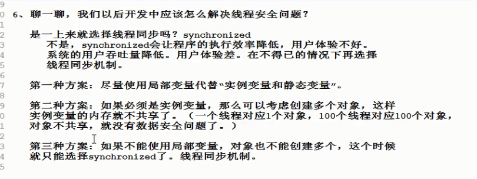

##### 守护线程&定时器

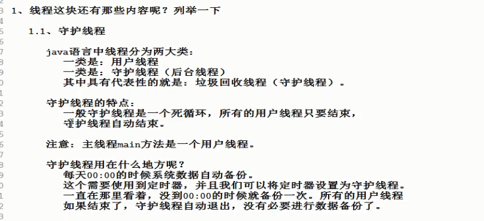

```java
public static void main(String[] args) throws InterruptedException {
    Thread t = new MyThread();
    t.setDaemon(true); / 启动线程前，将t设置为守护线程。所以当main方法结束，守护线程也就结束，即使t线程是死循环
    t.start();
    ... 
}
```


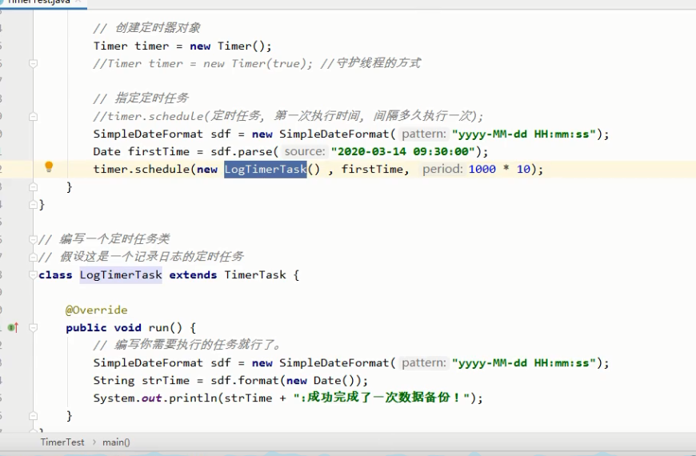

##### 创建线程的第三种方式

  

```java
public class Test {
    public static void main(String[] args) throws ExecutionException, InterruptedException {
        FutureTask task = new FutureTask(new Callable() {
            @Override
            public Object call() throws Exception {
                Thread.sleep(1000 * 5);
                return 1 + 2;
            }
        });

        Thread t = new Thread(task);
        t.start();
        Object obj = task.get(); // 缺点：使得当前线程阻塞，优点：获取t线程的结果
        System.out.println("线程执行最终结果 " + obj);

    }
}
```

##### wait和notify

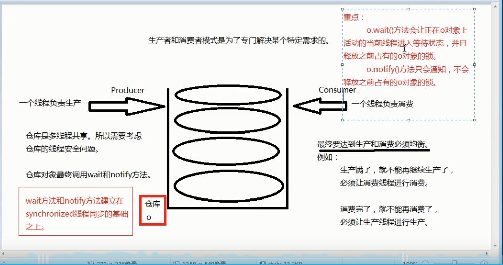

需求

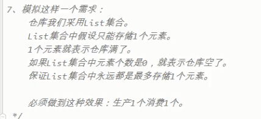


#### 注解

##### Override注解

- 标识性注解，给编译器参考的，编译器会自动检查是否重写了父类的方法，没有则报错，只能注解方法


##### 元注解

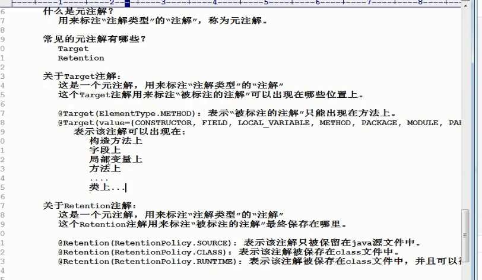

- 可以被反射机制所读取

  ```java
  // Retention的源代码
  public @interface Retention{
      RetentionPolicy value();
  }
  // RetentionPolicy的源代码
  public enum RetentionPolicy{
      SOURCE,
      CLASS,
      RUNTIME
  }
  @Retention(value=RetentionPolicy.SOURCE)
  public @interface MyAnnotation{
      
  }
  ```

##### 自定义注解

```java
public @interface MyAnnotation{
    String name(); // 属性，不是方法
    String value();
}

public @interface MyAnnotation1{
    String value(); // 属性只有一个value可以省略value
}
public class MyAnnotationTest{
	@MyAnnotation(name="zhangsan",value="haha")
    public void doSome(){};
    
    @MyAnnotation1("haha") // value可以省略
    public void doOther(){};
}
```

##### 属性是一个数组

```java
public @interface MyAnnotation{
	// 注解的属性可以是byte short int long float double boolean char String Class 枚举类型及以上的每一种数组形式
	int age();
    String[] email();
    Season[] seasonArray();
}

public class OtherAnnotation{
    @MyAnnotation(age = 25, email = {"zhangsan@123.com", "lisi@456.com"})
    public void doOther(){};
    
    @MyAnnotation(age = 25, email = "wangwu@789.com", seasonArray={Season.SPRING,Season.SUMMER})
    public void doOthe1(){};
}

enum Season {
    STRING,SUMMER,AUTUMN,WINTER
}
```

##### 反射注解

```java
import java.lang.annotation.ElementType;
import java.lang.annotation.Target;
import java.lang.annotation.Retention;
import java.lang.annotation.RetentionPolicy;
import java.lang.reflect.Method;

public static void main(String[] args)throws Exception{
	// 获取这个类
    Class c = Class.forName("com.lh.MyAnnotationTest");
    
    // -------------------- 1. 通过类上的属性 ------------------------
    // 判断类上面是否有@MyAnnnotation
    if(c.isAnnotationPresent(MyAnnotation.class)){
    // 获取该注解对象。返回的是Annotation，需要强制转型成MyAnnotation
        MyAnnotation myAnnotation = (MyAnnotation)c.getAnnotation(MyAnnotation.class); 
        System.out.println("类上面的注解对象" + myAnnnotation); // com.lh.MyAnnotation(value=SH)
        // 获取注解的属性
        String value = myAnnotation.value(); 
        System.out.println(value); // SH
    }
    
    // ----------------------- 2. 获取方法上的属性 ------------------------
    // 获取doOther()方法
    Method doSomeMethod = c.getDeclaredMethod("doSome");
    if(doSomeMethod.isAnnotationPresent(MyAnnotation.class)){
        MyAnnotation myAnnotation = doSomeMethod.getAnnotation(MyAnnotation.class);
        System.out.println(myAnnotation.value()); // BJ
    }
}

@MyAnnotation(value = "SH") 
public class MyAnnotationTest{
	@MyAnnotation(value = "BJ") 
    public void doSome(){   
    }
}

@Target({ElementType.TYPE, ElementType.METHOD})
@Retention(RetentionPolicy.RUNTIME)
public @interface MyAnnotation{
    String value();
}

```

##### 注解作用

- 需求：类中必须要有一个int型的id

```java
import java.lang.annotation.ElementType;
import java.lang.annotation.Target;
import java.lang.annotation.Retention;
import java.lang.annotation.RetentionPolicy;
import java.lang.reflect.Method;
import java.lang.reflect.Field;
import java.lang.annotation.Annotation;


public class Test{
	public static void main(String[] args) throws Exception{


		Class c = Class.forName("Person");
		if(c.isAnnotationPresent(Id.class)){
			Field[] fields = c.getDeclaredFields();
			boolean isOk = false;
			for(Field field : fields){
				if("id".equals(field.getName()) && "int".equals(field.getType().getSimpleName())){
					isOk = true;
					break;
				}
			}
			if(!isOk){
				throw new NotHasIntIdException("被@Id注解标注的类中必须要有一个int类型的id的属性！");
			}
		}	   		
	}
}


@Id
class Person{
	int id; // 必须有这个才不会报错int型的id
	String name;
}

@Target(ElementType.TYPE)
@Retention(RetentionPolicy.RUNTIME)
@interface Id{
}

class NotHasIntIdException extends RuntimeException{
	public NotHasIntIdException(){}
	
	public NotHasIntIdException(String s){
		super(s);
	}
}

```


